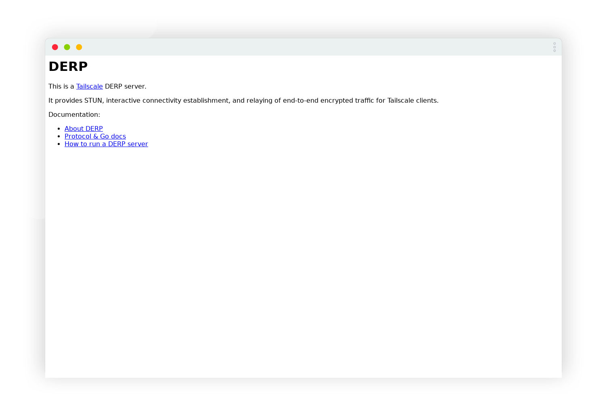

## 问题引入

Tailscale DERP 服务器设计为直接对外提供服务，甚至内置了 Let's Encrypt 自动证书申请功能。但这样必须直接将 80 和 443 端口分配给 DERP 容器，无法在该服务器上部署其他网站了。

在本文中，我们将在一个容器上部署 Caddy 服务，反向代理到 DERP 容器，从而实现多个网站共存。

## DERP 配置

我们使用 Docker Compose 部署 DERP 服务：

```yaml compose.yml
services:
  derper:
    image: ghcr.io/kaaanata/derper:latest
    container_name: derper
    restart: unless-stopped
    environment:
      - DERP_DOMAIN=derp.example.com
      - DERP_ADDR=:80 # 关键：默认为 443，需要改为非 443 端口
    networks:
      - shared_bridge
    ports:
      - "3478:3478/udp"
    volumes:
      - derp_certs:/app/certs
      - derp_data:/app/data

networks:
  shared_bridge:
    external: true

volumes:
  derp_certs:
  derp_data:
```

## Caddy 配置

Caddy 配置细节取决于 Caddy 实例的网络环境，本文我们将 Caddy 容器和 DERP 容器放在同一个自定义桥接网络 `shared_bridge` 中。

创建 shared_bridge 网络：

```bash
docker network create shared_bridge
```

Caddy 的 Docker Compose 配置如下：

```yaml compose.yml
# 简单示例
services:
  caddy:
    cap_add:
      - NET_ADMIN
    extra_hosts:
      - "host.docker.internal:host-gateway"
    image: caddy:latest
    networks:
      - shared_bridge
    ports:
      - "80:80"
      - "443:443"
      - "443:443/udp" # HTTP/3
    restart: unless-stopped
    volumes:
      - ./data/conf:/etc/caddy
      - ./data/srv:/srv
      - caddy_data:/data
      - caddy_config:/config

networks:
  shared_bridge:
    external: true

volumes:
  caddy_data:
  caddy_config:
```

Caddy 配置文件 `Caddyfile` 如下：

```caddyfile ./data/conf/Caddyfile
derp.example.com {
    reverse_proxy derper # 使用容器名称作为主机名，如果上面用的不是 80 端口，需要加上端口号
}
```

启动上述各容器，访问 `https://derp.example.com`，看到以下 DERP 页面即说明部署成功：



（DERP 还需要使用 UDP 3478 端口提供 STUN 服务，别忘了在防火墙打开该端口）

## 参考资料

- [Wind4/tailscale-derper 仓库描述](https://github.com/Wind4/tailscale-derper#:~:text=If%20you%20need%20to%20use%20a%20reverse%20proxy%20(Nginx%2C%20Traefik%2C%20Caddy)%20to%20manage%20TLS%20certificates%2C%20you%20can%20set%20%22%3A80%22%20to%20listen%20for%20http.)
- [Docker 镜像地址](https://github.com/kaaanata/derper-docker/pkgs/container/derper#:~:text=DERP_ADDR,%3A443)
- [Tailscale DERP 源代码](https://github.com/tailscale/tailscale/blob/bcceef36825278a7406dd38d2832f20540d698a0/cmd/derper/derper.go#L59C2-L59C14)
